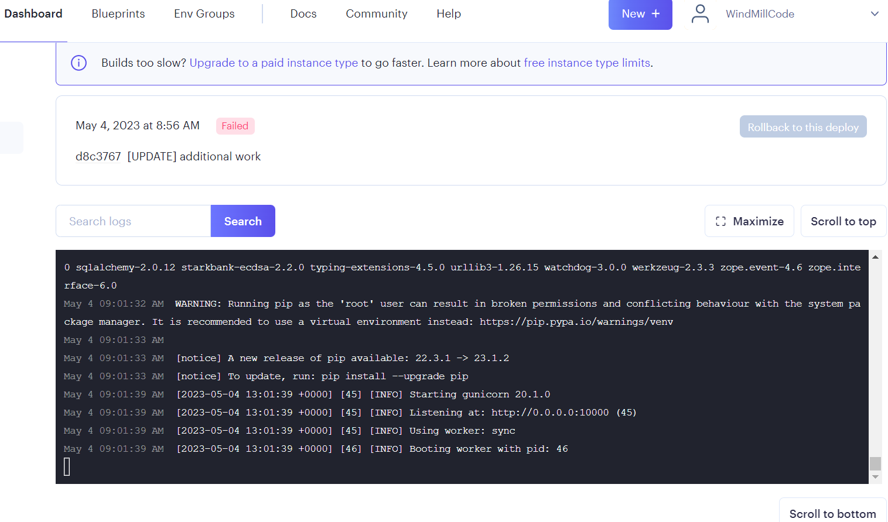

# Flask Docker Application is running but the hosting fails
<!--- Provide a general summary of the issue in the Title above -->

## Expected Behavior
* after the flask app starts sucessfully I should be able to connect to the applicaton

<!--- Tell us what should happen -->

## Current Behavior
the application running but render claims the build faild

<!--- Tell us what happens instead of the expected behavior -->

## Possible Solution

<!--- Not obligatory, but suggest a fix/reason for the bug, -->

## Steps to Reproduce

<!--- Provide a link to a live example, or an unambiguous set of steps to -->
<!--- reproduce this bug. Include code to reproduce, if relevant -->
1.
2.
3.
4.

## Environment
|property|value|data|
|:------|:------:|------|
||||
||||
||||
||||
||||
||||

## Files
<!-- paste snippets as well as upload files -->

<!--- How has this issue affected you? What are you trying to accomplish? -->
<!--- Providing context helps us come up with a solution that is most useful in the real world -->

<!--- Provide a general summary of the issue in the Title above -->

## Detailed Description
<!--- Provide a detailed description of the change or addition you are proposing -->

## Possible Implementation
<!--- Not obligatory, but suggest an idea for implementing addition or change -->
